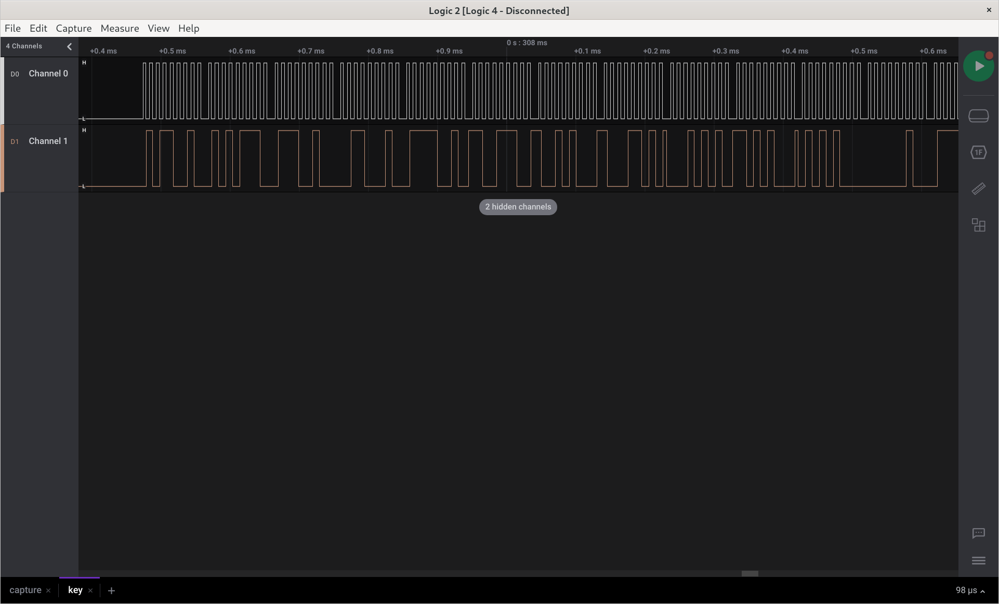
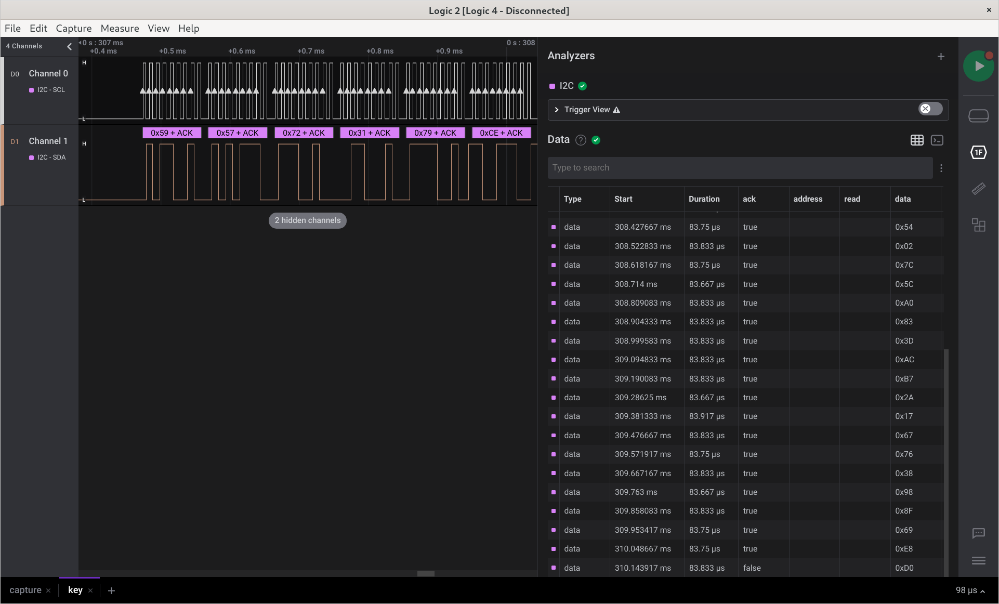
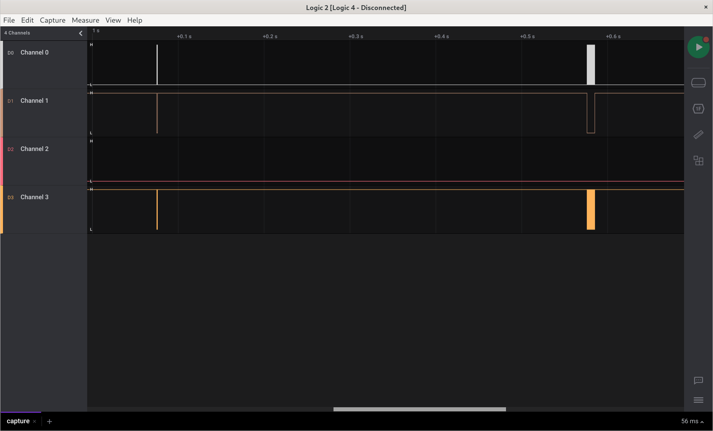
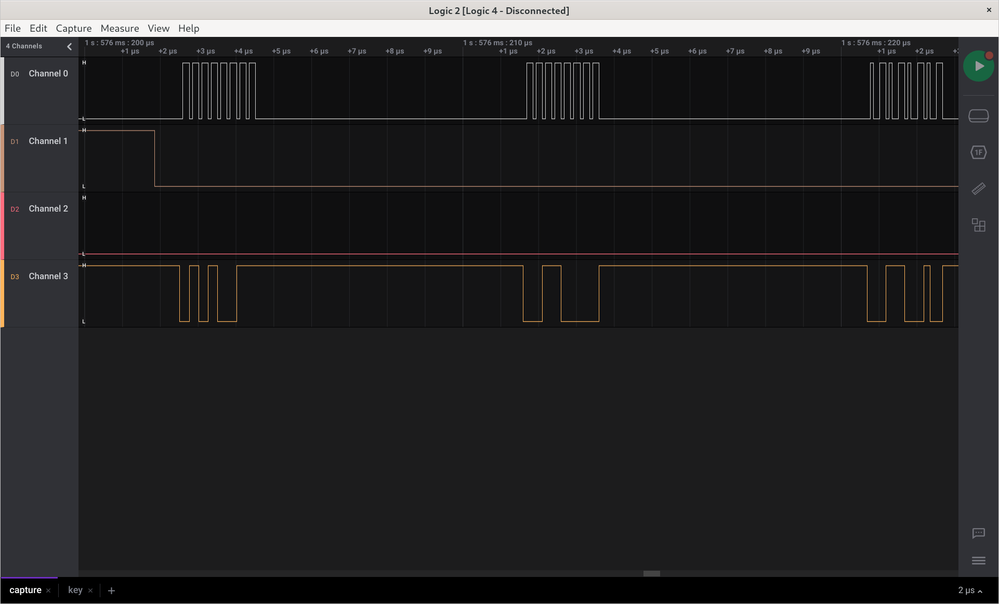
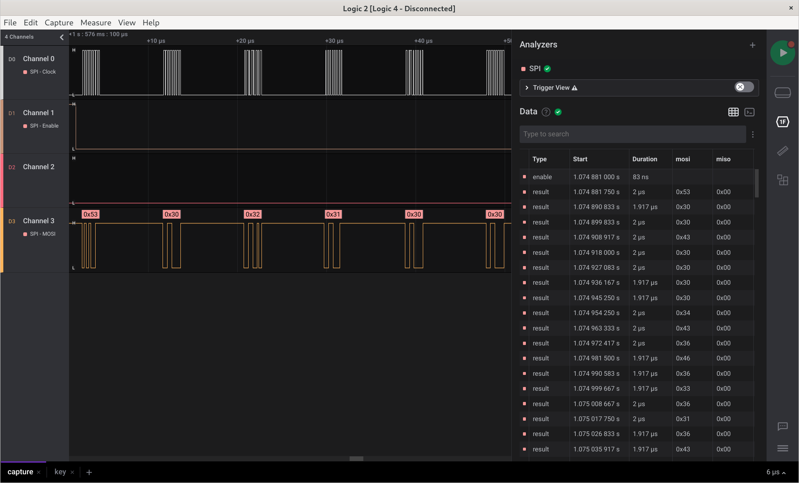
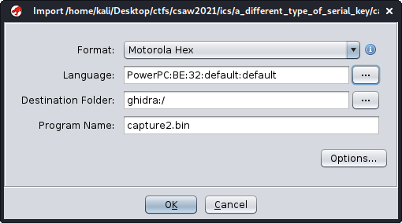

+++
title = "CSAW CTF Qualification Round 2021 - A Different Type of Serial Key"
date = 2021-09-13
[taxonomies]
tags = ["ctf", "embedded"]
+++

# A Different Type of Serial Key

## Task description

Attached are serial captures of two different uploads to an embedded device. One of these uploads is a key and the other is a function block. Your goal is to decode the serial traffic, extract the key and function block, and use these to find the flag. The flag will be in format flag{}.

Author: CISA

[capture.sal](files/capture.sal)
[key.sal](files/key.sal)

## Solution

### key.sal

Opening it up in Logic it looks like I2C with data (SDA) on channel 1 and clock (SCL) on channel 0.



Applying the I2C analyzer confirms it.



After exporting to csv we can extract the bytes using this simple python script:

```py3
with open("key.csv") as f:
    f.readline()  # skipping the csv header
    for l in f.readlines():
        l = l[:-1]
        byte = l.split(",")[3]
        print(f"{byte},", end="")
```

### capture.sal

Opening it up in Logic we see two communications.



Zooming in it looks like SPI with MOSI on channel 3, MISO on channel 2, clock on channel 0 and chip select on channel 1.



Enabling the SPI analyzer confirms it.



After exporting the data to csv, I manually splitted the file into two separate communications and using this script I turned them into binaries.

```py3
with open("capture.bin", "wb") as b:
    with open("capture.csv") as f:
        f.readline()
        for l in f.readlines():
            l = l[:-1]
            c = l.split(",")[2]
            b.write(int.to_bytes(int(c, 16), 1, byteorder="big"))
```

Running `file` on both of them showed `Motorola S-Record; binary data in text format`. According to [wikipedia](<https://en.wikipedia.org/wiki/SREC_(file_format)>) the first line (header) contains vendor specific ASCII text right after S0XXYYYY (X - byte count, Y - address).

And indeed it does, `4C6F63616C204B6579B` translates to `Local Key.` and `506F77657250432042696720456E6469616E2033322D42697420537475620E` to `PowerPC Big Endian 32-Bit Stub.`

Let's try the second file in ghidra.



And this is the code ghidra decompiled:

```c
void UndefinedFunction_000004ec(int param_1,int param_2)
{
  uint uStack20;

  uStack20 = 0;
  while ((int)uStack20 < 0x1d) {
    if ((uStack20 & 1) == 0) {
      *(byte *)(param_2 + uStack20) =
           *(byte *)(param_1 + uStack20) ^ *(char *)(_DAT_10020018 + uStack20) - 3U;
    }
    else {
      if ((int)uStack20 % 3 == 0) {
        *(byte *)(param_2 + uStack20) =
             *(byte *)(param_1 + uStack20) ^ *(char *)(_DAT_10020018 + uStack20) + 5U;
      }
      else {
        *(byte *)(param_2 + uStack20) =
             *(byte *)(param_1 + uStack20) ^ *(byte *)(_DAT_10020018 + uStack20);
      }
    }
    uStack20 = uStack20 + 1;
  }
  *(undefined *)(param_2 + 0x1d) = 0;
  return;
}
```

Basically a loop xoring two arrays with some minor modifications.

Extracting the bytes out of the local key (using wikipedia's info about SREC) and putting everything together gives us:

```py3
key = [
    0x59, 0x57, 0x72, 0x31, 0x79, 0xCE, 0x94,
    0x8D, 0x15, 0xD4, 0x54, 0x02, 0x7C, 0x5C,
    0xA0, 0x83, 0x3D, 0xAC, 0xB7, 0x2A, 0x17,
    0x67, 0x76, 0x38, 0x98, 0x8F, 0x69, 0xE8,
    0xD0,
]

local_key = [
    0x42, 0x3B, 0x16, 0x51, 0x05, 0xBD, 0xAA,
    0xFF, 0x27, 0xDB, 0x3B, 0x5D, 0x22, 0x34,
    0x97, 0xEA, 0x54, 0x9F, 0xDC, 0x4D, 0x27,
    0x33, 0x08, 0x08, 0xF7, 0xF9, 0x5D, 0x95,
    0xB0
]

flag = ""

for i in range(len(key)):
    if i % 2 == 0:
        flag += chr(key[i] ^ local_key[i] - 3)
    else:
        if i % 3 == 0:
            flag += chr(key[i] ^ local_key[i] + 5)
        else:
            flag += chr(key[i] ^ local_key[i])

print(flag)
```

The flag: `flag{s3r14l_ch4ll3ng3_s0lv3r}`
